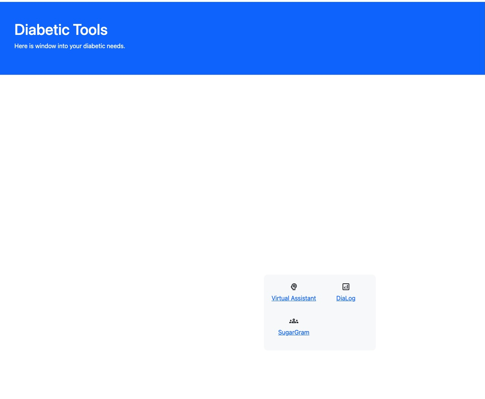
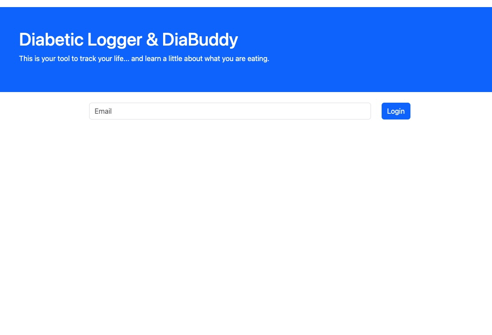
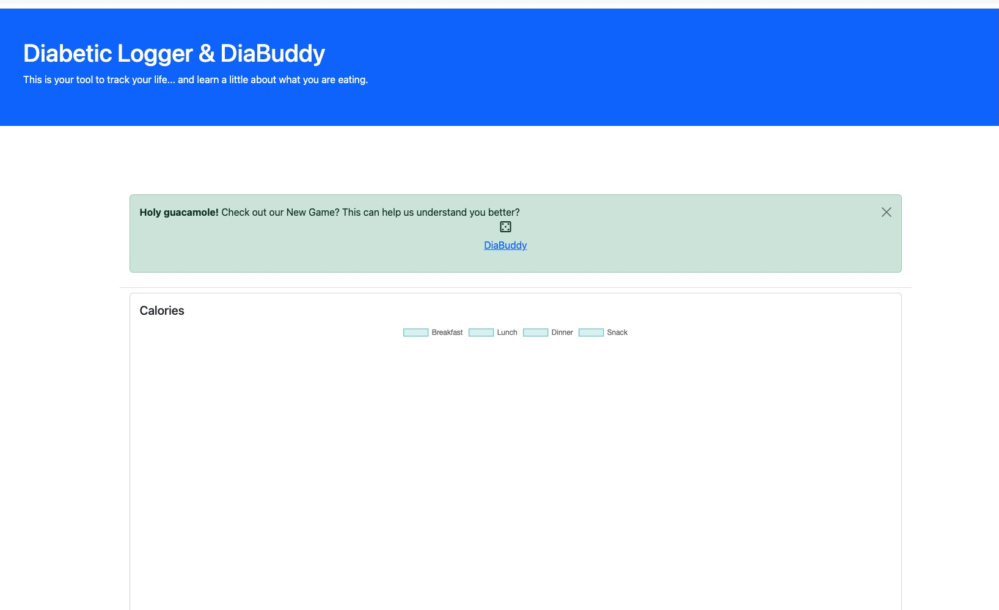

Sugagram Backend
================

# Flask Server

## Launcher
[Launcher](http://147.182.203.196:5000/)

This is a launcher for a few services hosted on a Flask server.  Since this project is hosted on a droplet on DigitalOcean.
It has its IP address. The base IP address of this entire project is 147.182.203.196.  These services are on port 5000. Everything is
accessible through a website. Please follow the above link or type 147.182.203.196:5000 in your browser to find the Launcher for these
Flask services.

## DiaBuddy
[Diabuddy](http://147.182.203.196:5000/DiaBuddy)

To access the DiaBuddy, you must first Sign In to the Dialog (Diabetic Logger). There is a link at the top of the home screen of the 
Dialog application. If you try to go directly, it should redirect you back to the login screen of the Dialog application.

## Dialog
[DiaLog](http://147.182.203.196:5000/SignIn)

The Dialog application is a major entry point into my project. This application will allow the user to log most of the data needed to develop the
user profile. Please follow the link above or type 147.182.203.196:5000/SignIn in a browser.  Once you are logged in, it should look like this:

